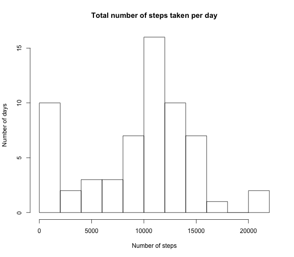
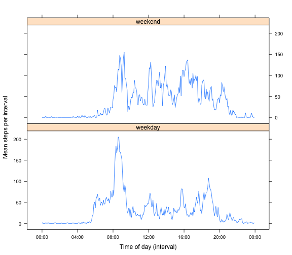

## Loading and preprocessing the data

The R code chunk below sets the working directory to my local project directory and loads the CSV file into a variable called `stepdata`. The `interval` variable is not continuous, but refers to the time (HHMM in 24h format, with leading zeros removed), so treating it as a `numeric` value will cause problems when plotting (missing values will be assumed). Thus, I'm converting both the date and the interval attributes to POSIXct (date/time) format. This will add a date (today) to the interval, so when displaying the value later in the analysis I will convert to a time only display format.


```r
setwd("~/Documents/Learning/Coursera/Data Science/Reproducible_Research/RepData_PeerAssessment1")
stepdata<-read.csv("activity.csv")
# Convert date and interval to POSIXct
stepdata$date<-as.POSIXct(stepdata$date)
# To convert interval use sprintf to pad the interval to four digits with leading zeros
stepdata$interval<-as.POSIXct(sprintf("%04d",stepdata$interval),format="%H%M")
```

## What is mean total number of steps taken per day?

Using the dplyr package and command chaining to group the data by date and to summarize the steps per date using the sum function (with `na.rm=T` to remove the NA values). 


```r
library(dplyr)
steps<-tbl_df(stepdata)
stepsperday<-steps %>% group_by(date) %>% summarize(totalsteps=sum(steps,na.rm=T))
# Plot histogram of steps per day
hist(stepsperday$totalsteps,breaks=10,main="Total number of steps taken per day",
     xlab="Number of steps",ylab="Number of days")
```

 

```r
# Calculate mean and median steps per day - nicely formatted with prettyNum
meanstepsperday<-prettyNum(mean(stepsperday$totalsteps),big.mark=",")
medianstepsperday<-prettyNum(median(stepsperday$totalsteps),big.mark=",")
```

I plotted the histogram with 10 breaks to provide a little more granularity to the plot than is provided by the default breaks. I also tried using 20 breaks, but that started to look messy with more bins containing zero or one day.

In this dataset, **the mean number of steps per day is 9,354.23 and the median is 10,395.**

## What is the average daily activity pattern?

Again using dplyr, but this time summarizing per interval (*i.e.* across days) and calculating the mean number of steps per interval (again with `na.rm=T`). I also calculated the median number of steps per interval as this is the value I chose for imputing missing values later in the analysis. 

The mean number of steps per interval is plotted below as a time series plot.


```r
# Chain dplyr commands to calculate mean steps per interval. Also calculate median steps per interval
# as I'll use this later in the analysis.
stepsperinterval<-steps %>% group_by(interval) %>% 
        summarize(meansteps=mean(steps,na.rm=T),mediansteps=median(steps,na.rm=T))
# Find the maximum number of mean steps, and the interval in which that maximum is found
maxmeansteps<-max(stepsperinterval$meansteps)
intervalmaxsteps<-stepsperinterval[stepsperinterval$meansteps==maxmeansteps,]$interval
# Plot time series. Add indication of where max is found (abline)
with(stepsperinterval,plot(interval,meansteps,type="l",main="Mean steps per 5 minute interval",
                           xlab="Time of day (interval)",ylab="Mean steps"))
abline(v=intervalmaxsteps,col="red",lty=2)
```

 

The maximum number of mean steps per five-minute interval (206.1698 steps) **was found in interval 0835 (*i.e.* 08:35 am)**. The interval contining the maximum number of mean steps is indicated by the dashed red line in the time series plot.

## Imputing missing values

*(Note to assessors: I ended up trying this with two different methods for comparison after my initial method made little change to the mean and median. Apologies for the extra reading...)*


```r
rowswithNA<-sum(is.na(steps[,1]))
```

There are 2,304 rows containing NA values in the data set.

To fill in the missing values, I chose to take the median number of steps for the corresponding interval across all days for which there are values (the median is less susceptible to outliers). This was computed in the code chunk above, so doesn't need to be recalculated.

The approach being taken is:

- Calculate the median number of steps per interval (already in `stepsperinterval$mediansteps`)
- Create an index vector of the same length as the `steps` data frame which matches `steps$interval` to the corresponding `stepsperinterval$interval`. 
- Add a new `fixedsteps` attribute to the data frame. This will take the value of `steps` if one exists; if `is.na(steps)` the index vector will be used to select the correct `mediansteps` value from `stepsperinterval`

(*This is not technically following the instruction to create a new data frame, but the end result is the same, it allowed me to more easily compare `steps` with `fixedsteps`, and the grading is based on the strategy and result, not on the details of the method.*)


```r
# Create an index for the staps data frame, pointing to the corresponding row in stepsperinterval
medianstepindex<-match(steps$interval,stepsperinterval$interval)

# Now mutate steps to add a 'fixedsteps' atribute. This is equal to steps, but if steps is NA, it uses the index
# just created to find the appropriate median steps value

steps<-mutate(steps,fixedsteps=ifelse(is.na(steps),stepsperinterval[medianstepindex,]$mediansteps,steps))

# Re-calculate steps per day using fixedsteps
fixedstepsperday<-steps %>% group_by(date) %>% summarize(totalsteps=sum(fixedsteps,na.rm=T))

# Plot as a histogram
hist(fixedstepsperday$totalsteps,breaks=10,main="Total steps per day (missing values replaced with median)",
     xlab="Number of steps",ylab="Number of days")
```

 

```r
# Calculate mean and median steps per day for imputed data, and the differences in mean and median
# between original and imputed data.
meanfixedstepsperday<-prettyNum(mean(fixedstepsperday$totalsteps),big.mark=",")
medianfixedstepsperday<-prettyNum(median(fixedstepsperday$totalsteps),big.mark=",")
meandiff<-mean(fixedstepsperday$totalsteps)-mean(stepsperday$totalsteps)
mediandiff<-median(fixedstepsperday$totalsteps)-median(stepsperday$totalsteps)
```

Surprisingly, replacing the `NA` values with the per-interval median has not changed the histogram. When plotted with 20 breaks (rather than 10 as shown here) eight days move from the 0-999 step bin to the 1000-1999 step bin. 

This suggests that the median values for the number of steps per interval is typically low. Indeed for 235 of the 288 intervals, the median is zero.

Imputing the missing (`NA`) values for the steps attributes results in the following changes to mean and median steps per day:

- The mean number of steps per day is 9,503.869, vs. 9,354.23 steps without imputing values; a difference of 149.6393 steps. 
- The median number of steps per day is 10,395, vs. 10,395 steps without imputing values; a difference of 0 steps. 

In summary, using the median steps per interval to replace `NA` values results in only a small change in the mean number of steps per day, and makes no difference to the median steps per day.

### Repeat with mean per interval instead of median

I'm now intrigued how different the result would be if the mean per interval were used instead of the median. The code, modified to make that change, is below along with the same summary results:


```r
# Now mutate steps to add a 'fixedsteps.mean' atribute, using the mean instead of median
steps<-mutate(steps,fixedsteps.mean=ifelse(is.na(steps),stepsperinterval[medianstepindex,]$meansteps,steps))

# Re-calculate steps per day using fixedsteps
fixedstepsperday.mean<-steps %>% group_by(date) %>% summarize(totalsteps=sum(fixedsteps.mean,na.rm=T))

# Plot as a histogram
hist(fixedstepsperday.mean$totalsteps,breaks=10,main="Total steps per day (missing values replaced with mean)",
     xlab="Number of steps",ylab="Number of days")
```

 

```r
# Calculate mean and median steps per day for imputed data, and the differences in mean and median
# between original and imputed data.
meanfixedstepsperday.mean<-prettyNum(mean(fixedstepsperday.mean$totalsteps),big.mark=",")
medianfixedstepsperday.mean<-prettyNum(median(fixedstepsperday.mean$totalsteps),big.mark=",")
meandiff.mean<-mean(fixedstepsperday.mean$totalsteps)-mean(stepsperday$totalsteps)
mediandiff.mean<-median(fixedstepsperday.mean$totalsteps)-median(stepsperday$totalsteps)
```

Imputing the missing (`NA`) values for the steps attributes using the mean results in the following changes to mean and median steps per day:

- The mean number of steps per day is 10,766.19, vs. 9,354.23 steps without imputing values; a difference of 1411.959 steps. 
- The median number of steps per day is 10,766.19, vs. 10,395 steps without imputing values; a difference of 371.1887 steps. 

As suspected, using the mean per interval rather than the median per interval results in a much greater change in the histogram (the mean steps per day for the recomputed days move into the bins that already had a higher frequency), and a much greater change in the mean and median steps per day. This is perhaps a more realistic method for imputing the missing values.

## Are there differences in activity patterns between weekdays and weekends?

In order to compare weekdays with weekends, I use the `weekdays()` function to evaluate each date in the dataset and to add an attribute `daytype` to the dataset.


```r
steps<-mutate(steps,daytype=as.factor(ifelse(weekdays(date) %in% c("Saturday","Sunday"),"weekend","weekday")))
```

Now recalculate the steps per interval (`stepsperinterval2`), grouping by `daytype` as well as `interval`. This is where my choice to convert the interval to `POSIXct` proved troublesome as modifying a `lattice` plot to display only the time (no date) took a bit of searching. It requires adding a `scales` argument to `xyplot`. To simplify the `xyplot` call a little, I created an `xtickinterval` vector that is then used to specify both the tick locations and the reformatted tick labels.


```r
library(lattice)

# Recalculate steps per interval, grouping by daytype as well as interval
stepsperinterval2<-steps %>% group_by(daytype,interval) %>% summarize(meansteps=mean(fixedsteps,na.rm=T))

# Choose the x-axis tick interval (4h steps from the first time point)
xtickinterval<-seq(stepsperinterval2[1,]$interval,by="4 hour",length=7)

# Plot time series for weekdays vs weekends as a panel plot. Use the tick interval to specify
# location and labels for x-axis tickmarks. (Use y-axis defaults)

xyplot(meansteps ~ interval | daytype,stepsperinterval2,type="l",layout=c(1,2),
       xlab="Time of day (interval)",ylab="Mean steps per interval",
       scales=list(x=list(at=xtickinterval,labels=format(xtickinterval,"%H:%M"))))
```

 

The panel plot shows the different patterns for weekday and weekend activity. Weekend activity starts a bit later in the day, with less of a pronounced peak around 8-9am, but with generally more activity in the afternoons.
