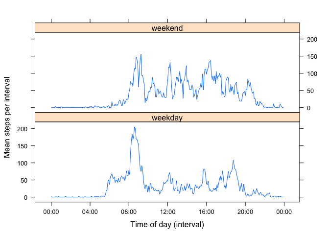

# Reproducible Research: Peer Assessment 1
Christopher Porter  

## Loading and preprocessing the data

For this section, the R code chunk below sets the working directory to my local project directory, loads the CSV file into a variable called stepdata, and converts the date field to a date (POSIXct) format. The interval refers to the time of day, so I'm also converting it to a datetime format; when displaying the value later in the document I will convert to a time only display format.


```r
setwd("~/Documents/Learning/Coursera/Data Science/Reproducible_Research/RepData_PeerAssessment1")
stepdata<-read.csv("activity.csv")
# Convert date to POSIXct
stepdata$date<-as.POSIXct(stepdata$date)
# Convert interval to POSIXct - date part will be today
stepdata$interval<-as.POSIXct(sprintf("%04d",stepdata$interval),format="%H%M")
summary(stepdata)
```

```
##      steps             date                    
##  Min.   :  0.00   Min.   :2012-10-01 00:00:00  
##  1st Qu.:  0.00   1st Qu.:2012-10-16 00:00:00  
##  Median :  0.00   Median :2012-10-31 00:00:00  
##  Mean   : 37.38   Mean   :2012-10-31 00:25:34  
##  3rd Qu.: 12.00   3rd Qu.:2012-11-15 00:00:00  
##  Max.   :806.00   Max.   :2012-11-30 00:00:00  
##  NA's   :2304                                  
##     interval                  
##  Min.   :2015-11-12 00:00:00  
##  1st Qu.:2015-11-12 05:58:45  
##  Median :2015-11-12 11:57:30  
##  Mean   :2015-11-12 11:57:30  
##  3rd Qu.:2015-11-12 17:56:15  
##  Max.   :2015-11-12 23:55:00  
## 
```

## What is mean total number of steps taken per day?

Using the dplyr package and command chaining to group the data by date and to summarize using the sum function.


```r
library(dplyr)
steps<-tbl_df(stepdata)
stepsperday<-steps %>% group_by(date) %>% summarize(totalsteps=sum(steps,na.rm=T))
hist(stepsperday$totalsteps,breaks=20,main="Total number of steps taken per day",
     xlab="Number of steps",ylab="Number of days")
```

 

```r
meanstepsperday<-prettyNum(mean(stepsperday$totalsteps),big.mark=",")
medianstepsperday<-prettyNum(median(stepsperday$totalsteps),big.mark=",")
```

In this dataset, the mean number of steps per day is 9,354.23 and the median is 10,395.

## What is the average daily activity pattern?

Again using dplyr, this time I summarize per interval (*i.e.* across days), and calculate the mean number of steps per interval. This is plotted as a time series plot.


```r
# Chain dplyr commands to calculate mean steps per interval. Also calculate median steps per interval
# as I'll use this later in the analysis.
stepsperinterval<-steps %>% group_by(interval) %>% summarize(meansteps=mean(steps,na.rm=T),
                                                             mediansteps=median(steps,na.rm=T))
maxmeansteps<-max(stepsperinterval$meansteps)
intervalmaxsteps<-stepsperinterval[stepsperinterval$meansteps==maxmeansteps,]$interval
# par(las=2)
with(stepsperinterval,plot(interval,meansteps,type="l",main="Mean steps per 5 minute interal",
                           xlab="Time of day (interval)",ylab="Mean steps"))
abline(v=intervalmaxsteps,col="red",lty=2)
```

 

```r
# Format the number for printing
maxmeansteps<-prettyNum(maxmeansteps)
```

The maximum number of mean steps per 5-minute interval (206.1698 steps) was found in interval 0835 (*i.e.* 08:35am). The interval contining the maximum number of mean steps is indicated by the dashed red line in the above plot.

## Imputing missing values


```r
rowswithNA<-sum(is.na(stepdata[,1]))
```

There are 2304 rows containing NA values in the data set.

To fill in the missing values, I'm going to take the median number of steps for that interval across all days for which there are values (the median is less susceptible to outliers.)


```r
# Now I'll use that median steps value I calculated in the code chunk above
# First, create an index for the staps data frame, pointing to the corresponding row in stepsperinterval

medianstepindex<-match(steps$interval,stepsperinterval$interval)

# Now mutate steps to add a 'fixedsteps' atribute. This is equal to steps, but if steps is NA, it uses the index
# just created to find the appropriate median steps value

steps<-mutate(steps,fixedsteps=ifelse(is.na(steps),stepsperinterval[medianstepindex,]$mediansteps,steps))

fixedstepsperday<-steps %>% group_by(date) %>% summarize(totalsteps=sum(fixedsteps,na.rm=T))
hist(fixedstepsperday$totalsteps,breaks=20,main="Total steps per day (missing values replaced with median)",
     xlab="Number of steps",ylab="Number of days")
```

 

```r
meanfixedstepsperday<-prettyNum(mean(fixedstepsperday$totalsteps),big.mark=",")
medianfixedstepsperday<-prettyNum(median(fixedstepsperday$totalsteps),big.mark=",")
```

Imputing the missing (NA) values for the steps attributes results in the following changes to mean and median steps per day:

- The mean number of steps per day is 9,503.869, vs. 9,354.23 steps previouly; a difference of 149.6393 steps. 
- The median number of steps per day is 10,395, vs. 10,395 steps previouly; a difference of 0 steps. 


## Are there differences in activity patterns between weekdays and weekends?

In order to compare weekdays with weekends, I'm using the weekdays() function to evaluate each date in the dataset and to add an attribute (daytype) to the dataset.


```r
steps<-mutate(steps,daytype=ifelse(weekdays(date) %in% c("Saturday","Sunday"),"weekend","weekday"))
```


```r
library(lattice)
stepsperinterval2<-steps %>% group_by(daytype,interval) %>% summarize(meansteps=mean(steps,na.rm=T))
xyplot(meansteps ~ interval | daytype,stepsperinterval2,type="l",layout=c(1,2),
       xlab="Time of day (interval)",ylab="Mean steps per interval",
       scales=list(x=list(at=seq(stepsperinterval2[1,]$interval,by="6 hour",length=5),
                          labels=format(seq(stepsperinterval2[1,]$interval,by="6 hour",length=5),"%H:%M"))))
```

 
